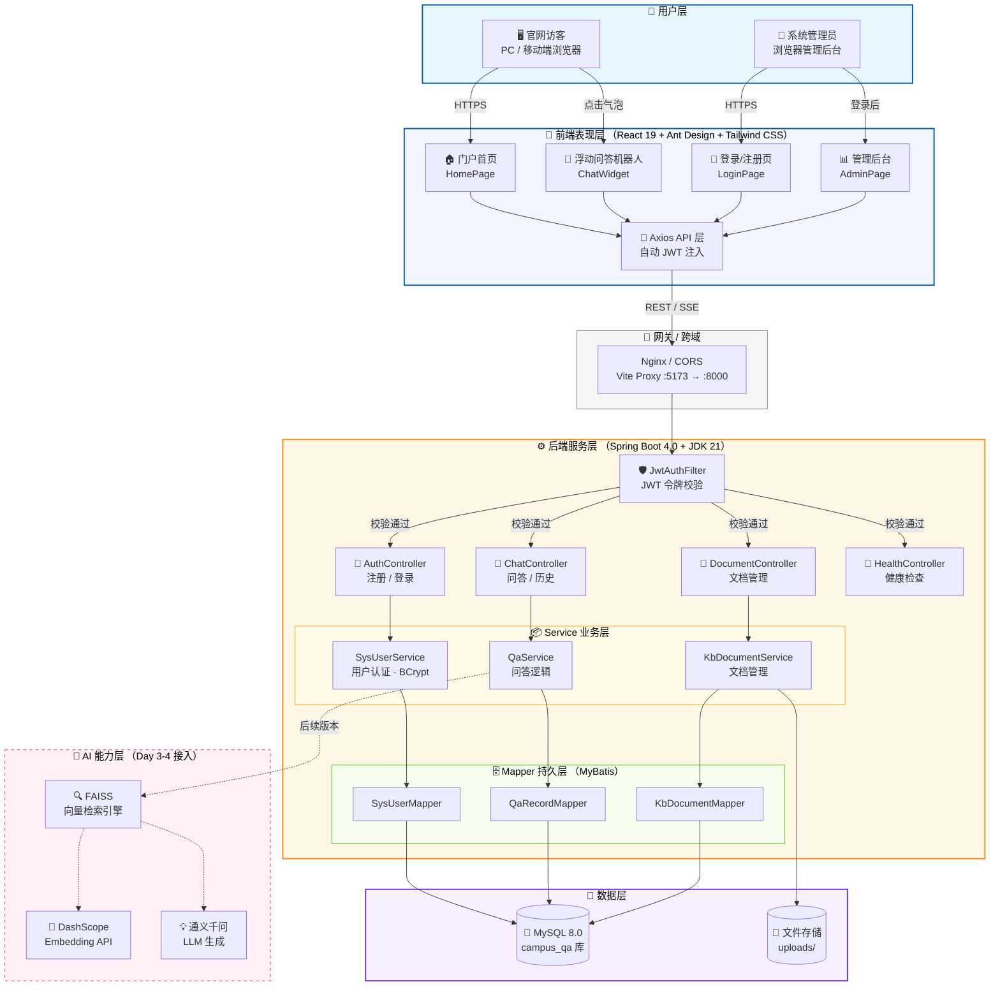
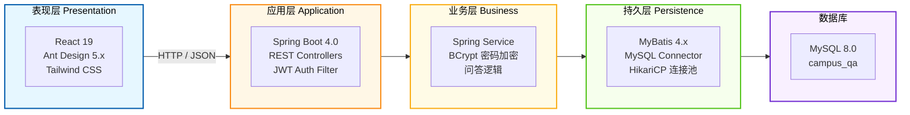
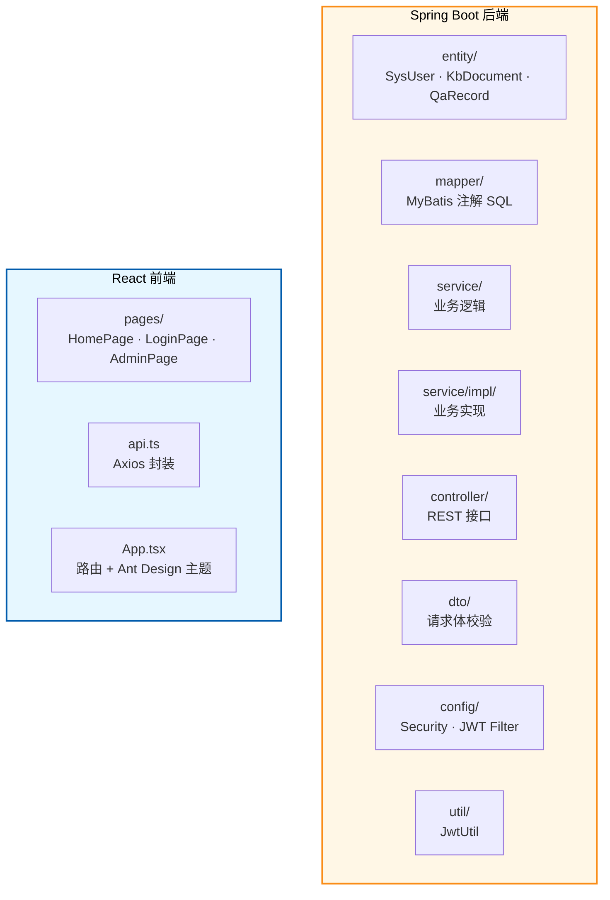

# 河海大学校园问答助手 — 系统架构图

> Day 1 产出 · 2026-07-15

## 整体架构



## 分层架构



## 数据流（问答请求为例）

```mermaid
sequenceDiagram
    actor User as 👤 用户
    participant Web as 🎨 React 前端
    participant API as ⚙️ Spring Boot
    participant DB as 🐬 MySQL
    participant AI as 🧠 RAG 引擎

    User->>Web: 输入问题 "图书馆几点关门？"
    Web->>Web: 检查 localStorage JWT token
    Web->>API: POST /api/chat/ask<br/>Authorization: Bearer &lt;token&gt;
    API->>API: JwtAuthFilter 校验 token
    API->>API: ChatController 接收请求
    API->>DB: qaRecordMapper.insert(question)
    API-->>Web: { answer: "...", sourceDocs: [...] }
    Web->>Web: 渲染回答 + 来源引用
    Note over AI: Day 3-4 接入向量检索<br/>DashScope Embedding<br/>通义千问 LLM 生成
```

## 项目包结构



---

## 技术选型总览

| 层级 | 技术 | 版本 |
|------|------|------|
| 前端框架 | React + TypeScript | 19.x / 5.x |
| UI 组件库 | Ant Design | 5.x |
| CSS 框架 | Tailwind CSS | 4.x |
| HTTP 客户端 | Axios | latest |
| 路由 | React Router DOM | 7.x |
| 后端框架 | Spring Boot | 4.0.0 |
| 语言 | Java (JDK) | 21 LTS |
| ORM | MyBatis Spring Boot Starter | 4.0.x |
| 数据库 | MySQL | 8.0 |
| 安全 | Spring Security + JWT (jjwt) | 0.12.x |
| 构建工具 | Maven Wrapper | 内置 |
| 工具库 | Lombok | 注入 |
| AI 引擎 | DashScope + FAISS | Day 3-4 接入 |

---

*架构图结束 — 河海大学校园问答助手 v1.0*
